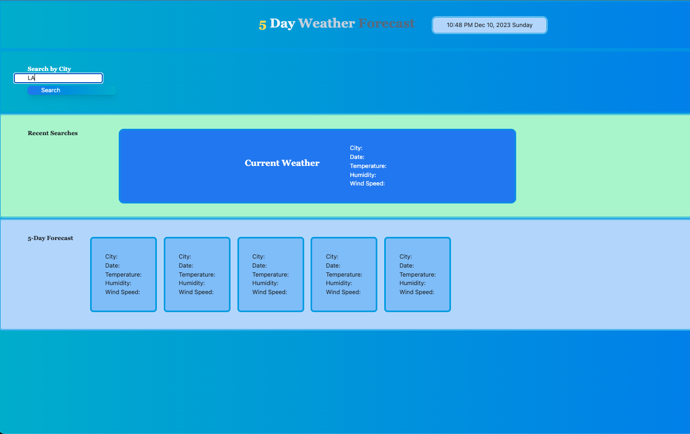
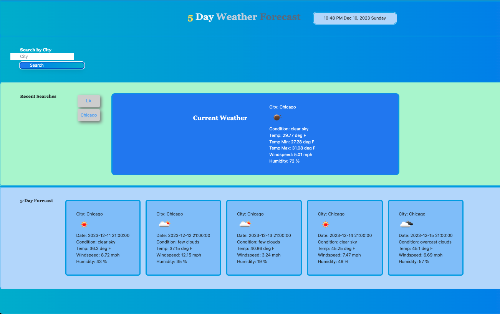
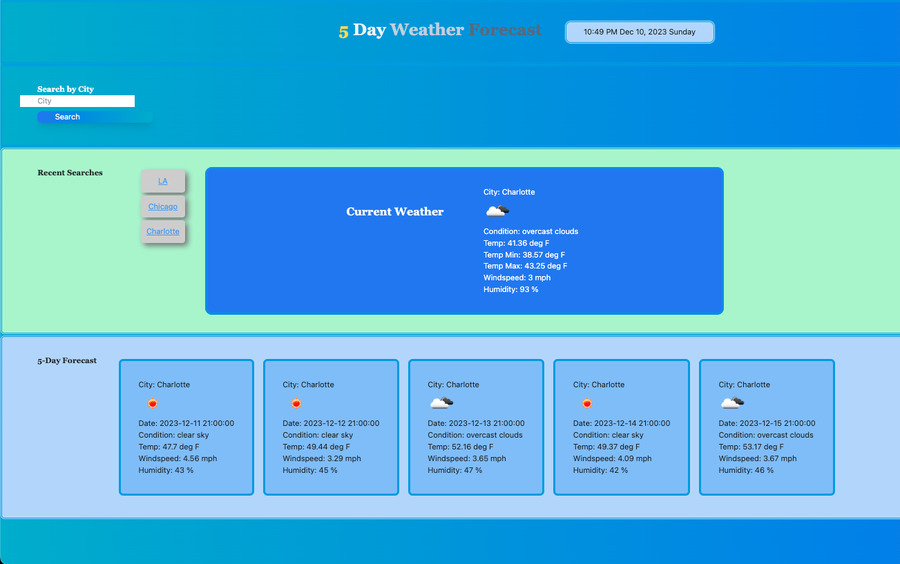

# weather-app
searchable 5 day weather forecast 

## Description

This application was developed as a class exercise for the edX coding bootcamp through the University of Oregon, Dec 2023. 

The site shows current weather and a five day forecast for a city searched in the field near the top of the page. 
Recently searched cities can be clicked on to search again in the list to the left of the 'Current Weather' field.

Additionally, the page shows the current day and time. 

Deployed Page: https://garrett-lieb.github.io/weather-app/

Garrett Lieb Github Repo Page: https://github.com/garrett-lieb/weather-app

## Installation

N/A

## Usage

The user can search for weather by a city name entered in the Search field by clicking the search button. Searched cities are stored in a list on the page, and the user can click the list items to search that city again.

## Credits

script.js lines 101-141 were completed during tutoring session with Andrew Hardemon on Friday Dec 8, 2023.

## Liscence

MIT Liscence

Copyright (c) 2023 Garrett Lieb

Permission is hereby granted, free of charge, to any person obtaining a copy of this software and associated documentation files (the "Software"), to deal in the Software without restriction, including without limitation the rights to use, copy, modify, merge, publish, distribute, sublicense, and/or sell copies of the Software, and to permit persons to whom the Software is furnished to do so, subject to the following conditions:

The above copyright notice and this permission notice shall be included in all copies or substantial portions of the Software.

THE SOFTWARE IS PROVIDED "AS IS", WITHOUT WARRANTY OF ANY KIND, EXPRESS OR IMPLIED, INCLUDING BUT NOT LIMITED TO THE WARRANTIES OF MERCHANTABILITY, FITNESS FOR A PARTICULAR PURPOSE AND NONINFRINGEMENT. IN NO EVENT SHALL THE AUTHORS OR COPYRIGHT HOLDERS BE LIABLE FOR ANY CLAIM, DAMAGES OR OTHER LIABILITY, WHETHER IN AN ACTION OF CONTRACT, TORT OR OTHERWISE, ARISING FROM, OUT OF OR IN CONNECTION WITH THE SOFTWARE OR THE USE OR OTHER DEALINGS IN THE SOFTWARE.